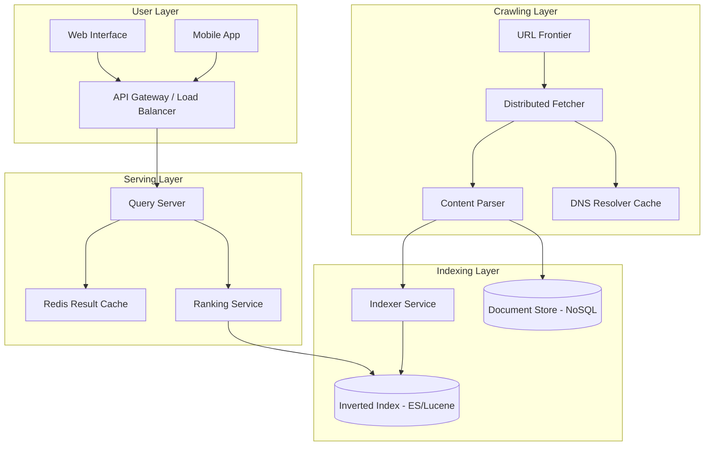
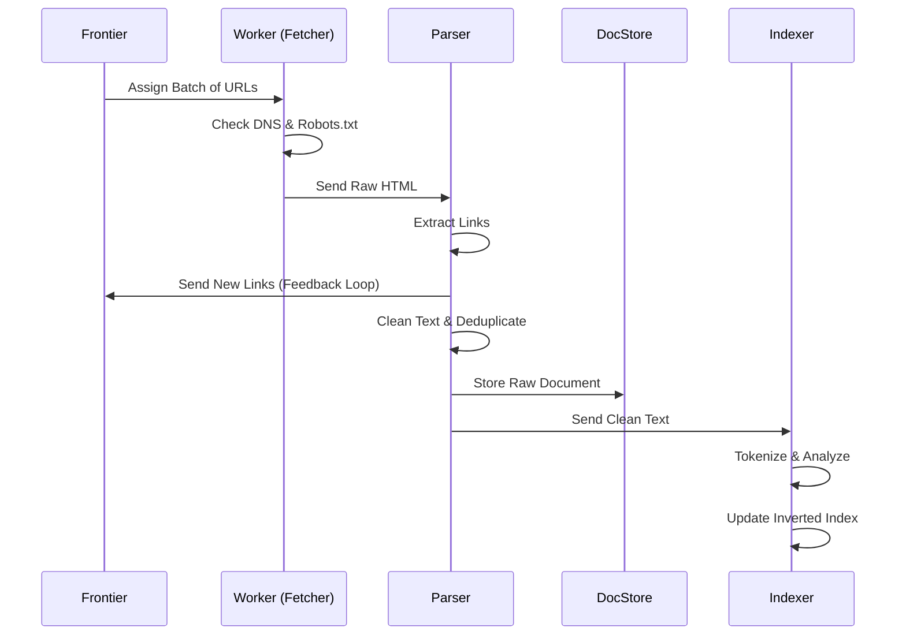
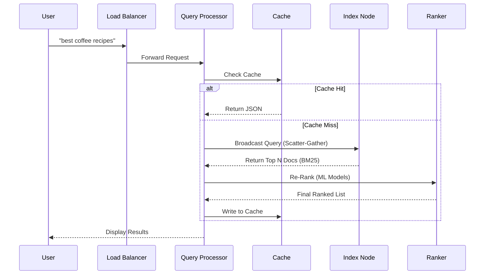
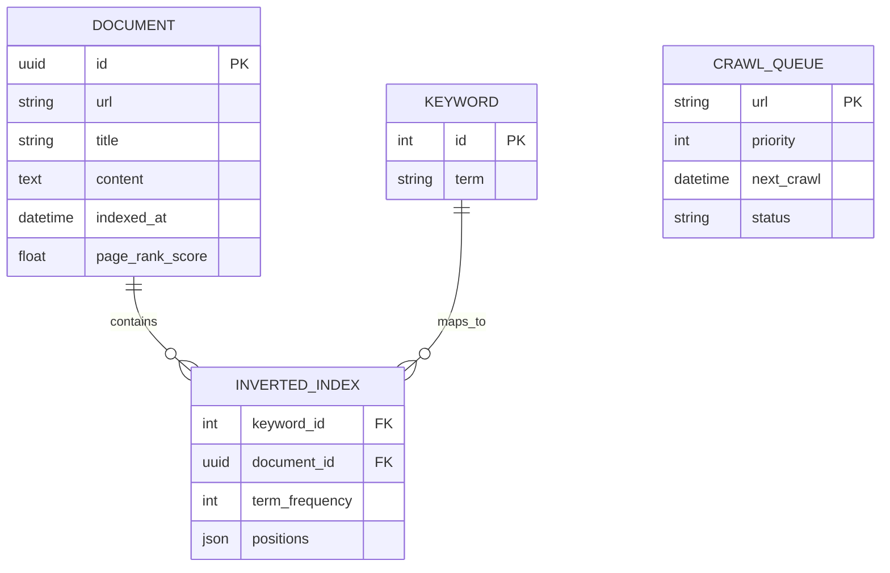

# Software Requirement Specification (SRS) - Comprehensive Enterprise Edition
**Project Name:** Seekora – Scalable Web Search Engine Platform  
**Version:** 2.0 (Enterprise)  
**Status:** Approved  
**Last Updated:** 2026-02-14  

---

## 1. Introduction

### 1.1 Purpose
The purpose of this document is to define the comprehensive technical specifications for **Seekora**, a high-performance, distributed web search engine. This SRS details the architectural decisions, data flow, algorithmic logic, and operational requirements necessary to build a system capable of indexing and querying millions of web pages with sub-second latency.

This document serves as the primary reference for:
- Backend Engineering Team (Crawling, Indexing, Ranking)
- DevOps/SRE Team (Infrastructure, Scaling, Monitoring)
- Frontend Development Team (UI/UX, API Integration)
- Product Management (Feature Roadmap, KPIs)

### 1.2 Scope
Seekora is engineered to be a fault-tolerant, distributed search platform. Unlike basic prototypes, Seekora implements industry-standard search engine components:
- **Distributed Crawler:** Handles billions of URLs with politeness policies and duplicate detection.
- **Inverted Indexer:** Lucene-based indexing with tokenization, stemming, and stop-word removal.
- **Query Processor:** Advanced query understanding, spell correction, and semantic expansion.
- **Ranking Engine:** Hybrid ranking using BM25, TF-IDF, and PageRank signals.

### 1.3 Definitions & Acronyms
| Term | Definition |
| :--- | :--- |
| **QPS** | Queries Per Second (Throughput metric) |
| **Indexing Latency** | Time from crawling a page to it being searchable |
| **Inverted Index** | Data structure mapping content terms to document locations |
| **Frontier** | Priority queue managing URLs to be crawled |
| **Sharding** | Partitioning data across multiple nodes for scalability |
| **SimHash** | Algorithm for near-duplicate detection |

---

## 2. System Architecture

### 2.1 High-Level Architecture
Seekora employs a microservices-based architecture to ensure independent scaling of crawling, indexing, and serving layers.

### 2.2 Component Breakdown

#### 1. URL Frontier (The Scheduler)
- **Responsibility:** Manages the queue of URLs to be crawled.
- **Logic:** Prioritizes high-quality domains and ensures politeness (delaying requests to the same host).
- **Storage:** Redis (Metadata) + Kafka (Queue).

#### 2. Distributed Fetcher (The Crawler)
- **Responsibility:** Downloads web pages.
- **Logic:** Asynchronous I/O (aiohttp/Twisted), handles robots.txt compliance, follows redirects.
- **Scale:** Multiple worker nodes running in parallel.

#### 3. Content Parser
- **Responsibility:** Extracts text, metadata, and links.
- **Logic:**
    - HTML Sanitization (BeautifulSoup/lxml).
    - Link Extraction (for Frontier).
    - Duplicate Detection (SimHash/MinHash).

#### 4. Indexer
- **Responsibility:** updates the Inverted Index.
- **Pipeline:**
    - **Tokenization:** Splitting text into words.
    - **Normalization:** Lowercasing, accent removal.
    - **Stemming:** Converting words to root forms (running -> run).
    - **Stop-word Removal:** Filtering common words (the, is, at).

#### 5. Query Server & Ranker
- **Responsibility:** Processes user queries and returns sorted results.
- **Ranking Signals:**
    - **BM25 Score:** Term frequency saturation.
    - **PageRank:** Link analysis score (static rank).
    - **Freshness:** Recency of the document.

---

## 3. Detailed Data Flow

### 3.1 Crawling & Indexing Pipeline
This diagram illustrates how a URL becomes a searchable document.

### 3.2 Search Query Execution
This diagram shows the lifecycle of a search request.

---

## 4. Functional Requirements

### 4.1 Search Capabilities
- **FR-01: Boolean Search:** Support AND, OR, NOT operators.
- **FR-02: Phrase Search:** Support exact match queries using quotes `"query"`.
- **FR-03: Autocomplete:** Provide real-time suggestions (< 200ms latency).
- **FR-04: Spell Correction:** "Did you mean..." suggestions using Levenshtein distance.

### 4.2 Crawling Intelligence
- **FR-05: Politeness:** Enforce per-domain rate limits (e.g., 1 request per 2 seconds).
- **FR-06: Deep Crawl:** Configurable depth limit (default: 3 hops from seed).
- **FR-07: Recrawl Policy:** Adaptive scheduling based on page update frequency.

### 4.3 Ranking & Relevance
- **FR-08: Static Ranking:** Use PageRank calculated offline via MapReduce.
- **FR-09: Dynamic Ranking:** Real-time scoring using TF-IDF and proximity (words close together).
- **FR-10: Snippet Generation:** Dynamic highlighting of query terms in search results.

---

## 5. Deployment & Infrastructure

### 5.1 Technology Stack
| Component | Technology | Rationale |
| :--- | :--- | :--- |
| **Language** | Python (Django/FastAPI) | Rapid development, rich AI ecosystem. |
| **Crawler** | Scrapy / Celery | Distributed task queue management. |
| **Search Engine** | Elasticsearch (Lucene) | Industry standard for scalable full-text search. |
| **Database** | PostgreSQL / MySQL | Reliable ACID storage for metadata. |
| **Unstructured** | MongoDB / Cassandra | High write throughput for raw document storage. |
| **Cache** | Redis / Memcached | Sub-millisecond latency for hot queries. |
| **Queue** | RabbitMQ / Kafka | Decoupling crawler and indexer services. |

### 5.2 Scalability Strategy
- **Horizontal Scaling:** Adding more low-cost nodes rather than upgrading hardware.
- **Index Sharding:** Splitting the inverted index into segments distributed across nodes.
- **replication:** Replicating index shards for high availability and read throughput.

---

## 6. Database Design

### 6.1 Entity Relationship Diagram (ERD)

### 6.2 Schema Details
- **`inverted_index` table:** The core of the search engine. Optimizes lookups by mapping `keyword_id` -> `document_id`. 
- **`positions` column:** JSON array `[10, 45, 102]`. Stores word offsets for phrase search and proximity ranking.

---

## 7. Performance & Quality Assurance

### 7.1 Service Level Agreements (SLAs)
- **Search Latency:** 99th percentile (p99) < 500ms.
- **Availability:** 99.9% uptime (max 8.7 hours downtime/year).
- **Freshness:** New pages indexed within 10 minutes of crawling.

### 7.2 Unit & Integration Testing
- **Search Relevance:** Benchmarking against a "Golden Set" of queries and expected results (NDCG metric).
- **Load Testing:** Simulating 10,000 concurrent users using Locust or JMeter.
- **Chaos Engineering:** Randomly killing crawler nodes to test recovery mechanisms.

---

## 8. Conclusion
Seekora is designed not just as a search tool, but as a distributed platform capable of scaling to enterprise demands. By leveraging microservices, advanced caching strategies, and industry-standard ranking algorithms, it provides a foundation robust enough for real-world application and rigorous academic evaluation.
