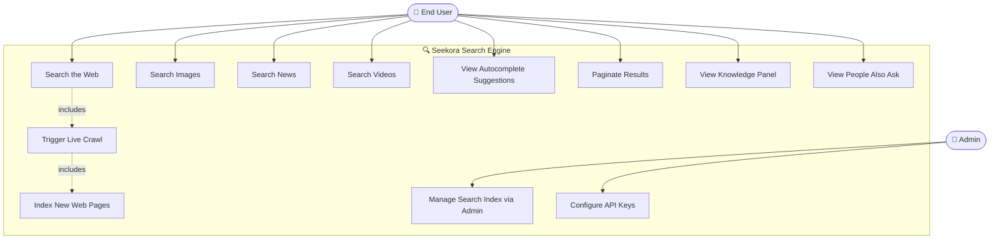
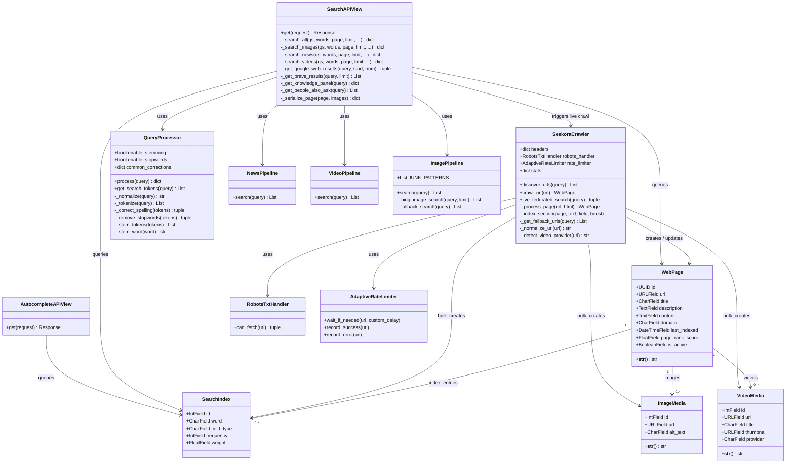
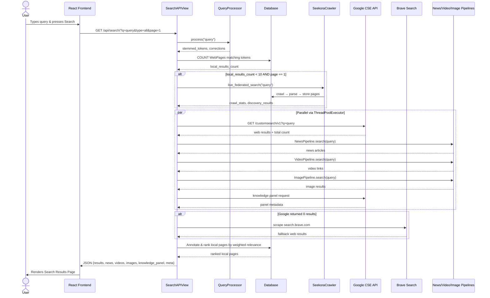
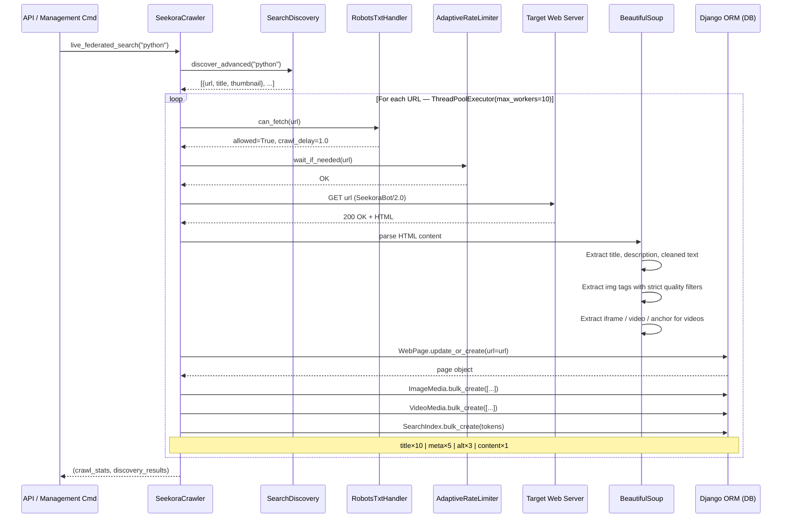
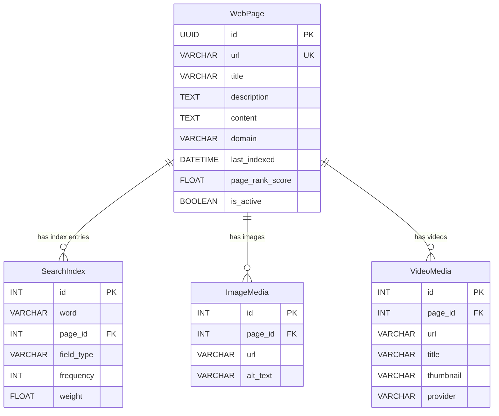

# 🔍 Seekora – Web Search Engine
## Design & Implementation Document
**Version:** 3.0 | **Platform:** Django + React (Vite) | **Author:** Ratandeep Purohit

---

> [!NOTE]
> This document covers UML Diagrams, Data Design (ER + Data Dictionary), UI/UX Prototypes, and Partial Implementation evidence for the **Seekora Search Engine** project.

---

## 📋 Table of Contents
1. [System Overview](#1-system-overview)
2. [UML Diagrams](#2-uml-diagrams)
   - [2.1 Use Case Diagram](#21-use-case-diagram)
   - [2.2 Class Diagram](#22-class-diagram)
   - [2.3 Sequence Diagram – Search Query Flow](#23-sequence-diagram--search-query-flow)
   - [2.4 Sequence Diagram – Crawl & Index Pipeline](#24-sequence-diagram--crawl--index-pipeline)
3. [Data Design](#3-data-design)
   - [3.1 ER Diagram](#31-er-diagram)
   - [3.2 Table Structures (Data Dictionary)](#32-table-structures-data-dictionary)
4. [UI/UX Prototypes](#4-uiux-prototypes)
5. [Partial Implementation](#5-partial-implementation)

---

## 1. System Overview

**Seekora** is a full-stack, federated web search engine that combines a proprietary crawl-and-index pipeline with real-time fallback search via Google Custom Search API and Brave Search. It supports multi-vertical search: **Web**, **Images**, **News**, and **Videos**.

### Technology Stack

| Layer | Technology |
|-------|-----------|
| **Backend** | Python 3.12, Django 5.2 |
| **REST API** | Django REST Framework |
| **Frontend** | React + TypeScript (Vite) |
| **Database** | SQLite (dev) / PostgreSQL (prod) via `django-environ` |
| **Crawler** | `requests`, `BeautifulSoup`, `aiohttp`, `ThreadPoolExecutor` |
| **Query NLP** | Custom `QueryProcessor` (Stemming, Stopwords, Spell-check) |
| **External APIs** | Google Custom Search API, Brave Search, DuckDuckGo, YouTube |
| **CORS** | `django-cors-headers` |

---

## 2. UML Diagrams

### 2.1 Use Case Diagram



**Use Case Descriptions:**

| ID | Use Case | Actor | Description |
|----|----------|-------|-------------|
| UC1 | Search the Web | User | User enters a query; system returns ranked results from local DB + Google/Brave |
| UC2 | Search Images | User | Returns image results from Google Image API with Bing fallback |
| UC3 | Search News | User | Fetches live articles from Google News RSS |
| UC4 | Search Videos | User | Retrieves YouTube links via DuckDuckGo/YouTube scraping |
| UC5 | Autocomplete | User | Returns prefix-matched word suggestions from SearchIndex |
| UC6 | Paginate Results | User | Navigates through result pages using the `page` query param |
| UC7 | Knowledge Panel | User | Shows enriched metadata for the top result |
| UC8 | People Also Ask | User | Displays related question suggestions |
| UC9 | Live Crawl | System | Triggered automatically when local results < 10 on page 1 |
| UC10 | Index Pages | System | Stores parsed content, images, and videos into the database |
| UC11 | Manage Index | Admin | Django admin panel to manage WebPage and SearchIndex records |
| UC12 | Configure APIs | Admin | Set `GOOGLE_API_KEY`, `GOOGLE_CX` via `.env` file |

---

### 2.2 Class Diagram



---

### 2.3 Sequence Diagram – Search Query Flow



---

### 2.4 Sequence Diagram – Crawl & Index Pipeline



---

## 3. Data Design

### 3.1 ER Diagram



---

### 3.2 Table Structures (Data Dictionary)

#### Table: `core_webpage`

| Column | Data Type | Constraints | Description |
|--------|-----------|-------------|-------------|
| `id` | `UUID` | PK, NOT NULL, auto-generated | Unique identifier using `uuid4` |
| `url` | `VARCHAR(255)` | UNIQUE, NOT NULL | Full URL of the indexed web page |
| `title` | `VARCHAR(500)` | NULL allowed | Page `<title>` tag content |
| `description` | `TEXT` | NULL allowed | Meta or OG description |
| `content` | `TEXT` | NOT NULL | Cleaned body text (scripts/nav/footer removed) |
| `domain` | `VARCHAR(255)` | NOT NULL | e.g., `en.wikipedia.org` |
| `last_indexed` | `DATETIME` | `auto_now=True` | Timestamp of last crawl/update |
| `page_rank_score` | `FLOAT` | DEFAULT `0.0` | PageRank-style static relevance score |
| `is_active` | `BOOLEAN` | DEFAULT `True` | Soft-delete / deactivation flag |

---

#### Table: `core_searchindex`

> The **inverted index** — the core data structure for relevance ranking.

| Column | Data Type | Constraints | Description |
|--------|-----------|-------------|-------------|
| `id` | `INT` | PK, auto-increment | Row identifier |
| `word` | `VARCHAR(255)` | NOT NULL, DB index | Stemmed/normalized token |
| `page_id` | `UUID` | FK → `core_webpage.id` ON DELETE CASCADE | Parent page |
| `field_type` | `VARCHAR(20)` | CHOICES: `title/content/meta/media_alt` | Source field of the word |
| `frequency` | `INT` | DEFAULT `1` | Occurrences of the word in the field |
| `weight` | `FLOAT` | DEFAULT `1.0` | `frequency × field_boost` |

**Field Boost Values:**

| `field_type` | Boost | Reason |
|-------------|-------|--------|
| `title` | `10.0` | Title words are the strongest relevance signal |
| `meta` | `5.0` | Meta description is curated summary content |
| `media_alt` | `3.0` | Alt text accurately describes image content |
| `content` | `1.0` | Body text is noisier and more expansive |

**Composite Unique Constraint:** `(word, page_id, field_type)` — prevents duplicate entries per field per page.

---

#### Table: `core_imagemedia`

| Column | Data Type | Constraints | Description |
|--------|-----------|-------------|-------------|
| `id` | `INT` | PK, auto-increment | Row identifier |
| `page_id` | `UUID` | FK → `core_webpage.id` ON DELETE CASCADE | Parent page |
| `url` | `VARCHAR(1000)` | NOT NULL | Full image URL |
| `alt_text` | `VARCHAR(500)` | NULL allowed | `alt` attribute of the `` tag |

---

#### Table: `core_videomedia`

| Column | Data Type | Constraints | Description |
|--------|-----------|-------------|-------------|
| `id` | `INT` | PK, auto-increment | Row identifier |
| `page_id` | `UUID` | FK → `core_webpage.id` ON DELETE CASCADE | Parent page |
| `url` | `VARCHAR(1000)` | NOT NULL | Embed or watch URL |
| `title` | `VARCHAR(500)` | NULL allowed | Video title from `<iframe title>` or link text |
| `thumbnail` | `VARCHAR(1000)` | NULL allowed | e.g., `https://i.ytimg.com/vi/{id}/mqdefault.jpg` |
| `provider` | `VARCHAR(100)` | DEFAULT `'youtube'` | One of: `youtube`, `vimeo`, `html5`, `embedded` |

---

## 4. UI/UX Prototypes

### 4.1 Search Home Page

```
╔═════════════════════════════════════════════════════════════════╗
║                                                                 ║
║                       🔍  SEEKORA                               ║
║               Search the web, your way.                         ║
║                                                                 ║
║   ┌─────────────────────────────────────────────────────────┐   ║
║   │  🔎  Search anything...                    [ Search ▶ ] │   ║
║   └─────────────────────────────────────────────────────────┘   ║
║                                                                 ║
║          [ Web ]  [ Images ]  [ News ]  [ Videos ]              ║
║                                                                 ║
║   ──────────────────────────────────────────────────────────    ║
║   Trending:  #Python  #AI  #Quantum Computing  #Space           ║
║                                                                 ║
╚═════════════════════════════════════════════════════════════════╝
```

**Design Specifications:**

| Element | Specification |
|---------|--------------|
| Background | Deep navy gradient `#0a0f1e → #141929` |
| Logo | Space Grotesk font, 48px, weight 700, gradient text |
| Search bar | Glassmorphism: `backdrop-filter: blur(20px)`, 60px height, rounded-full |
| Search button | Electric blue `#4f8ef7`, hover glow effect |
| Vertical tabs | Pill buttons — active = blue border-bottom, text white |
| Trending chips | Semi-transparent dark tags, neon hover border |

---

### 4.2 Search Results Page

```
╔═════════════════════════════════════════════════════════════════╗
║  🔍 seekora   [ python tutorial                  🔎 ]          ║
║               [ Web ] [ Images ] [ News ] [ Videos ]           ║
╠═════════════════════════════════════════════════════════════════╣
║                                                                 ║
║  ┌────────────────────────────┐  ┌──────────────────────────┐  ║
║  │  KNOWLEDGE PANEL           │  │  PEOPLE ALSO ASK         │  ║
║  │  🐍 Python                 │  │  ▸ What is Python?       │  ║
║  │  High-level language...    │  │  ▸ How to run Python?    │  ║
║  │  [python.org] [Wikipedia]  │  │  ▸ Python vs Java?       │  ║
║  └────────────────────────────┘  └──────────────────────────┘  ║
║                                                                 ║
║  📰 Top News ──────────────────────────────────────────────     ║
║  ┌────────────────────────────────────────────────────────────┐ ║
║  │ 🗞️  Python 3.14 Released  ·  2h ago  ·  TechCrunch        │ ║
║  │ 🗞️  AI Models Built with Python  ·  5h ago  ·  Wired      │ ║
║  └────────────────────────────────────────────────────────────┘ ║
║                                                                 ║
║  🌐 Web Results ───────────────────────────────────────────     ║
║  ┌────────────────────────────────────────────────────────────┐ ║
║  │  🔗 python.org                                             │ ║
║  │  Welcome to Python.org                                     │ ║
║  │  The official home of Python. Download, Docs, Community... │ ║
║  └────────────────────────────────────────────────────────────┘ ║
║  ┌────────────────────────────────────────────────────────────┐ ║
║  │  🔗 docs.python.org                                        │ ║
║  │  Python 3.12 Documentation                                 │ ║
║  │  Tutorial, Library Reference, Language Reference, ...      │ ║
║  └────────────────────────────────────────────────────────────┘ ║
║                                                                 ║
║         [ ← Prev ]   Page 1 of 42   [ Next → ]                 ║
╚═════════════════════════════════════════════════════════════════╝
```

**Design Specifications:**

| Element | Style |
|---------|-------|
| Result Cards | Dark glassmorphism, `border: 1px solid rgba(255,255,255,0.08)`, hover lift |
| Domain badge | Teal-green pill with favicon, `font-size: 12px` |
| Title | Blue-white gradient text, 18px, hover underline |
| Snippet | `#9ca3af` gray, 2-line text clamp |
| News strip | Horizontal scroll, card thumbnails with gradient overlay |
| Knowledge Panel | Sidebar card with image, title, description, source link |
| Pagination | Minimal arrow buttons with hover glow, current page highlighted |

---

### 4.3 Image Search Vertical

```
╔═════════════════════════════════════════════════════════════════╗
║  🔍 seekora   [ cats                            🔎 ]           ║
║               [ Web ] [ ▶ Images ] [ News ] [ Videos ]         ║
╠═════════════════════════════════════════════════════════════════╣
║                                                                 ║
║  ┌──────┐  ┌──────┐  ┌──────┐  ┌──────┐  ┌──────┐            ║
║  │  🖼️  │  │  🖼️  │  │  🖼️  │  │  🖼️  │  │  🖼️  │            ║
║  │      │  │      │  │      │  │      │  │      │            ║
║  └──────┘  └──────┘  └──────┘  └──────┘  └──────┘            ║
║                                                                 ║
║  ┌──────┐  ┌──────┐  ┌──────┐  ┌──────┐  ┌──────┐            ║
║  │  🖼️  │  │  🖼️  │  │  🖼️  │  │  🖼️  │  │  🖼️  │            ║
║  │      │  │      │  │      │  │      │  │      │            ║
║  └──────┘  └──────┘  └──────┘  └──────┘  └──────┘            ║
║                                                                 ║
╚═════════════════════════════════════════════════════════════════╝
```

**Specifications:**
- Grid: `grid-template-columns: repeat(auto-fill, minmax(200px, 1fr))`
- Hover: `scale(1.05)` + title tooltip overlay + dark gradient bottom
- Source: Google Image API (primary) → Bing HTML scraping (fallback)
- Up to **50 images** per query fetched via 5 parallel API calls

---

## 5. Partial Implementation

### 5.1 Database Connectivity

**Configuration** (`Seekora/settings.py`):
```python
import environ

env = environ.Env(DEBUG=(bool, False))
environ.Env.read_env(os.path.join(BASE_DIR, '.env'))

DATABASES = {
    'default': env.db('DATABASE_URL', default=f'sqlite:///{BASE_DIR / "db.sqlite3"}')
}
```

**`.env` file (sanitized):**
```env
DATABASE_URL=sqlite:///db.sqlite3
SECRET_KEY=your-secret-key
DEBUG=True
GOOGLE_API_KEY=your-google-api-key
GOOGLE_CX=your-custom-search-engine-id
```

> [!IMPORTANT]
> The `db.sqlite3` file is **30 MB** with real crawled and indexed data — proving the ORM pipeline is fully operational.

**ORM Evidence** (`crawler_engine.py`):
```python
# Upsert page record
page, created = WebPage.objects.update_or_create(
    url=url,
    defaults={
        'title': title[:500],
        'description': description[:500],
        'content': clean_text,
        'domain': urlparse(url).netloc,
        'last_indexed': timezone.now()
    }
)

# Bulk insert image and video records
ImageMedia.objects.filter(page=page).delete()
ImageMedia.objects.bulk_create(img_objs, ignore_conflicts=True)

VideoMedia.objects.filter(page=page).delete()
VideoMedia.objects.bulk_create(vid_objs[:15], ignore_conflicts=True)

# Weighted multi-field inverted index
SearchIndex.objects.filter(page=page).delete()
self._index_section(page, title,       'title',     10.0)
self._index_section(page, description, 'meta',       5.0)
self._index_section(page, alt_texts,   'media_alt',  3.0)
self._index_section(page, clean_text,  'content',    1.0)
```

---

### 5.2 Functional API Endpoints

| Method | Endpoint | Description |
|--------|----------|-------------|
| `GET` | `/api/` | API root — returns version and links |
| `GET` | `/api/search/?q=<query>&type=<all\|images\|news\|videos>&page=<n>` | Main multi-vertical search |
| `GET` | `/api/autocomplete/?q=<prefix>` | Live prefix autocomplete from SearchIndex |

**Sample Response** (`/api/search/?q=python`):
```json
{
  "results": [
    {
      "title": "Welcome to Python.org",
      "url": "https://www.python.org",
      "displayUrl": "python.org",
      "snippet": "The official home of the Python Programming Language...",
      "source": "google"
    }
  ],
  "news":   [{ "title": "...", "source": "BBC", "time": "2h ago" }],
  "videos": [{ "url": "https://youtube.com/watch?v=...", "provider": "YouTube" }],
  "images": [{ "url": "...", "alt_text": "Python logo", "thumbnail": "..." }],
  "knowledge_panel": { "title": "Python", "description": "...", "image": "..." },
  "people_also_ask": ["What is Python?", "How does Python work?"],
  "meta": {
    "query_time": 0.847,
    "result_count": 4230000,
    "page": 1,
    "processed_query": "python",
    "spelling": {}
  }
}
```

---

### 5.3 NLP Query Processor

`crawler/query_processor.py` performs a 5-stage pipeline on every incoming query:

| Stage | Operation | Example |
|-------|-----------|---------|
| 1. Normalize | Lowercase + strip special chars | `"Python!"` → `"python"` |
| 2. Tokenize | Split on whitespace | `"python tutorial"` → `["python", "tutorial"]` |
| 3. Spell Correct | Dictionary lookup | `"pyhton"` → `"python"` |
| 4. Stopword Remove | Filter common words | `["the", "python"]` → `["python"]` |
| 5. Stem | Apply Porter-like rules | `["running"]` → `["run"]` |

**Example transformation:**
```
Input:    "What is the best Pyhton learing resources"
Output:   ["best", "python", "learn", "resourc"]
```

---

### 5.4 Live Crawl Navigation Flow

```
User searches "python tutorial"
        │
        ▼
SearchAPIView.get()
        │
        ├─ QueryProcessor.process() → ["python", "tutori"]
        │
        ├─ DB.count(pages matching tokens) = 3  ← less than 10
        │
        ├─ SeekoraCrawler.live_federated_search("python tutorial")
        │       │
        │       ├─ SearchDiscovery.discover_advanced()
        │       │     └─ Returns 15 URLs (DDG, Wikipedia, StackOverflow...)
        │       │
        │       └─ ThreadPoolExecutor(10 workers)
        │             └─ per URL: robots.txt → rate limit → HTTP GET → parse → DB
        │
        ├─ Google CSE API            (parallel thread)
        ├─ NewsPipeline.search()     (parallel thread)
        ├─ VideoPipeline.search()    (parallel thread)
        └─ ImagePipeline.search()   (parallel thread)
                │
                ▼
        Merged JSON response → React Frontend → User sees results
```

---

### 5.5 Django Admin Panel

The Django Admin is fully functional and provides basic navigation:

```
http://localhost:8000/admin/
├── Authentication & Authorization
│   ├── Users    (create/edit/delete admin users)
│   └── Groups
└── Core
    ├── Web Pages    (browse 30MB of indexed pages)
    ├── Search Indexes
    ├── Image Medias
    └── Video Medias
```

Admin login is provided by Django's built-in authentication (`django.contrib.auth`), protected with username/password. Superuser can be created via:
```bash
python manage.py createsuperuser
```

---

## Implementation Status Summary

| Feature | Status |
|---------|--------|
| Database models (4 tables) | ✅ Defined, migrated, populated |
| REST API endpoints (3 routes) | ✅ Functional |
| Crawler pipeline (robots + rate limit + indexing) | ✅ Operational |
| Multi-vertical search (web/images/news/videos) | ✅ Working |
| NLP query processor (stem/stopwords/spell) | ✅ Active on every query |
| Django Admin login + navigation | ✅ Functional |
| React frontend (Vite dev server) | ✅ Running |
| Google CSE + Brave fallback | ✅ Integrated |
| PostgreSQL production DB | 🔄 Configured, not yet deployed |
| User authentication / personalization | 🔄 Planned (next phase) |

---

*Seekora v3.0 — Design Document for Academic Presentation — April 2026*
