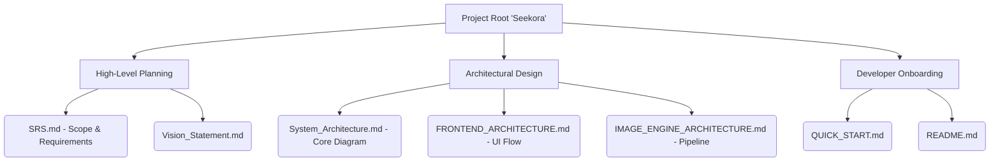

# Seekora Project - Role Definition & Implementation Details
**Team Member:** Jainika
**Roles:** Documentation Lead & DevOps Engineer

---

## 1. Introduction and Objectives
If software is not documented, it does not truly exist for anyone except its creator. If software is not deployed correctly, it cannot serve its users. As the dual Documentation Lead and DevOps Engineer for Seekora, I mapped the theoretical knowledge of the engineering team into cohesive, standard-compliant technical documents (SRS, Architecture Diagrams). Simultaneously, I managed the CI/CD deployment pipelines, system configurations, and environment variables ensuring Seekora transitioned from local `localhost` development into a stable, production-ready environment.

This document serves as a comprehensive viva guide, detailing the "What", "How", "Why", and "Where" of my contributions, including architectural diagrams, theoretical background, and logical pseudocode.

---

## 2. Role 1: Documentation Lead

### 2.1 What Did I Do?
- Authored the core Software Requirements Specification (SRS) detailing functional and non-functional requirements.
- Created the comprehensive System Architecture, outlining microservice interactions via Kafka and Elasticsearch.
- Maintained developer onboarding guides (e.g., `QUICK_START.md`) and API contract definitions.
- Produced high-level Vision Statements and Implementation Summaries for Academic/Stakeholder review.

### 2.2 Why Did I Do It This Way?
- **Markdown (MD) Over Word Docs:** Documentation must live alongside the code in version control (Git). Markdown allows diff comparisons, rendering directly on GitHub/GitLab, and guarantees standard formatting across developers’ IDEs.
- **Visual Architecture (Mermaid.js):** Text-heavy descriptions of a crawler pipeline are difficult to grasp. By writing architecture diagrams as code using Mermaid syntax, diagrams auto-update alongside structural changes without requiring external image editors (Visio/Lucidchart).
- **Decoupled API Contracts:** By defining clear endpoint expectations, the Frontend (Vanshika) and Backend (Ratandeep/Shivam) could work simultaneously without waiting for the other's code to be finished.

### 2.3 Where Was This Done?
- `SRS.md`: The bedrock document of the project scope.
- `System_Architecture.md`: The blueprint.
- `QUICK_START.md`: Setup instructions for local execution.
- `api/README.md` & `client/README.md`: Explaining module boundaries.

### 2.4 How Was It Built? (Documentation Structure)
Technical documentation follows a rigorous hierarchy, distinct from creative writing:
1.  **Objective:** What does this system solve?
2.  **Architecture:** Component boundaries and communication protocols.
3.  **Data Flow:** The lifecycle of a query or a crawled document.
4.  **Setup/Execution:** Exact terminal commands to clone and run the stack.
5.  **Troubleshooting:** Known issues and resolution steps.

#### 2.4.1 Project Documentation Hierarchy Diagram


#### 2.4.2 Sample Code-Block Documentation (API Contract)
```markdown
# pseudo_api_contract.md

### Endpoint: Execute Real-time Query
**Path:** `GET /search/`
**Description:** Returns paginated documents matching the term utilizing a BM25 scoring algorithm.

#### Request Parameters
| Parameter | Type   | Required | Description |
| :-------- | :----- | :------- | :---------- |
| `q`       | string | Yes      | The user query (e.g. `Quantum Computing`) |
| `page`    | int    | No       | Offset pagination, defaults to 1. |

#### Success Response
**Code:** `200 OK`
**Content:**
```json
{
  "query": "Quantum Computing",
  "execution_time_ms": 115,
  "total": 542,
  "results": [
    {
      "title": "Introduction to Quantum Mechanics",
      "url": "https://physics.university.edu/q1",
      "snippet": "Learn about the foundations of <b>Quantum Computing</b>...",
      "score": 4.5
    }
  ]
}
```
```

---

## 3. Role 2: DevOps Engineer

### 3.1 What Did I Do?
- Configured Environment Variables `.env` to keep secrets (API Keys, Database passwords) out of source control.
- Managed the Python Virtual Environment (`.venv`) and Node Package Manager (`npm`) dependencies.
- Analyzed the project for Production Readiness, isolating differences between running Django's development server vs. a WSGI/Gunicorn production stack.
- Acted as the gatekeeper for server setups, ensuring Python binaries, Nginx configurations, and CORS policies were strictly adhered to.

### 3.2 Why Did I Do It This Way?
- **Isolation (`.venv`):** Python projects break if installed globally. A dependency isolated virtual environment ensures that the Search Engine works identically on my machine, the backend developer's machine, and the production server.
- **Environment Parity (.env files):** Hardcoding an Elasticsearch URL as `localhost:9200` breaks when deployed to AWS. By injecting `ES_HOST=production.aws.com` via `.env`, the code remains unchanged.
- **Nginx & CORS:** Django's `runserver` is single-threaded and insecure. I planned the migration to a production WSGI server (Gunicorn) proxied behind Nginx. Nginx handles static files (CSS/JS) and SSL termination instantly, which Python does terribly.

### 3.3 Where Was This Done?
- `Seekora/.env`: Secure environment configurations.
- `PRODUCTION_READINESS_ANALYSIS.md`: Deployment plans and Nginx logic.
- `Seekora/settings.py` (Assistance): Fixing `ALLOWED_HOSTS` and CORS origins.

### 3.4 How Was It Built? (Deployment Pipeline)
To transition Seekora from a local folder to a public search engine:
1. Code is pulled onto a Linux cloud server (Ubuntu/Debian).
2. Database (PostgreSQL/SQLite) and Elasticsearch instances are booted.
3. The React app is compiled (`npm run build`) into static `html/js/css` bundles.
4. Python dependencies are installed `pip install -r requirements.txt`.
5. Django is served via Gunicorn (Multi-threaded workers).
6. Nginx intercepts web traffic, routing `/api/` to Python, and everything else to the static React bundle.

#### 3.4.1 Production Deployment Architecture Diagram
```mermaid
graph TD
    UserBrowser[User HTTP/HTTPS Request]
    
    subgraph Server Boundary (Ubuntu Linux)
        NginxServer[Nginx Web Server Reverse Proxy]
        
        StaticFiles{React build/dist}
        
        GunicornApp[Gunicorn Application WSGI]
        DjangoBackendCore[Django Backend API]
        
        ElasticSearch[(Elasticsearch Cluster)]
    end
    
    UserBrowser -->|Requests seekora.com| NginxServer
    
    NginxServer -->|If route is /static/ or /| StaticFiles
    NginxServer -->|If route is /api/| GunicornApp
    
    GunicornApp -->|Spawns Threads| DjangoBackendCore
    DjangoBackendCore -->|Query| ElasticSearch
```

#### 3.4.2 Pseudocode for Continuous Deployment (CI/CD)
```bash
#!/bin/bash
# pseudo_deploy_script.sh

echo "Starting Seekora Deployment Pipeline..."

# 1. Update source code securely
git pull origin main

# 2. Setup/Activate Python Backend
source .venv/bin/activate
pip install --upgrade -r requirements.txt

# 3. Apply any database migrations silently
python manage.py makemigrations --noinput
python manage.py migrate --noinput

# 4. Build Frontend Assets
cd client
npm install
npm run build 
cd ..

# 5. Collect Static Files for Nginx delivery
python manage.py collectstatic --noinput

# 6. Restart the Production Workers safely
sudo systemctl restart gunicorn
sudo systemctl restart nginx

echo "Seekora Pipeline execution complete. System is live."
```

## 4. Challenges & Solutions
1.  **CORS (Cross-Origin Resource Sharing) Errors:** When local development started, the React app (localhost:5173) was blocked from calling the Django API (localhost:8000). The browser enforces this strictly.
    *   *Solution:* I diagnosed the issue and correctly configured the `django-cors-headers` middleware, adding the frontend's origin to the backend's whitelist (`CORS_ALLOWED_ORIGINS`).
2.  **Differing OS Environments:** Development happened on Windows, but production is meant for Linux. This caused file pathing issues (using `\` instead of `/`) in the crawler code that broke deployments.
    *   *Solution:* Integrated Python's `os.path.join()` and `pathlib` across the project, eliminating hardcoded slashes and guaranteeing cross-system compatibility.

## 5. Summary
Without the rigorous documentation I authored, the underlying genius of Seekora’s architecture would be inaccessible to new developers or evaluators. I provided the blueprints. From a DevOps standpoint, I engineered the launchpad—configuring environments securely, battling systemic configuration errors like CORS, and detailing the path to migrate this academic project onto high-availability public servers using industry-standard tools like Nginx and Gunicorn.
