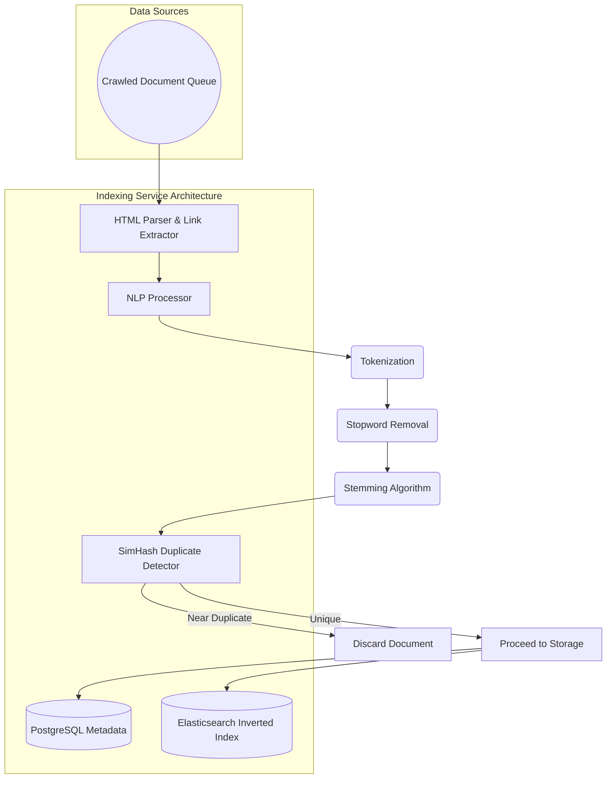
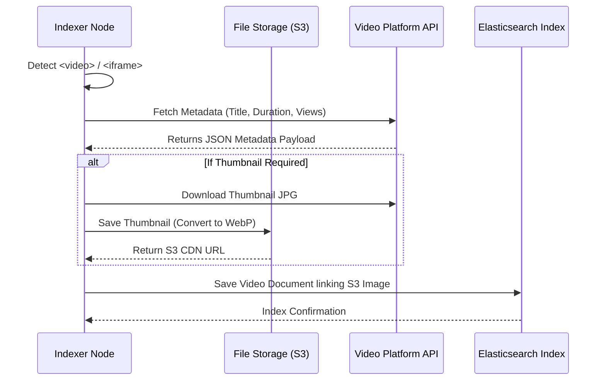

# Seekora Project - Role Definition & Implementation Details
**Team Member:** Jay
**Roles:** Indexing & Database Engineer & Video Search Engineer

---

## 1. Introduction and Objectives
I played a pivotal role in the core data processing framework of Seekora, turning unstructured raw HTML and video metadata into structured, searchable indexes. While our Web Crawlers collected data, it was my job as the Indexing & Database Engineer to ingest, parse, structure, and store it efficiently. Furthermore, as the Video Search Engineer, I pioneered the architecture needed to index video content, distinguishing our search engine from simple text-based retrieval systems.

This document serves as a comprehensive viva guide, detailing the "What", "How", "Why", and "Where" of my contributions, including architectural diagrams, theoretical background, and logical pseudocode.

---

## 2. Role 1: Indexing & Database Engineer

### 2.1 What Did I Do?
- Subscribed to the crawler message queue (Kafka) to process raw HTML data.
- Built the NLP (Natural Language Processing) text extraction logic: tokenization, stop-word removal, and stemming.
- Designed the Inverted Index structure using Elasticsearch/Lucene architectures.
- Managed the primary PostgreSQL database to store user information, analytics, and metadata.
- Implemented `SimHash` algorithms to discard near-duplicate content so our index remains highly qualitative.

### 2.2 Why Did I Do It This Way?
- **Inverted Index over RelationalDB:** A relational DB (`WHERE content LIKE '%search%'`) scans every row, resulting in `O(N)` time complexity. An inverted index maps words to documents, achieving an `O(1)` or `O(log N)` lookup.
- **Microservices for Indexing:** Crawling is network-bound, indexing is CPU-bound. If they shared a monolithic codebase, string processing would choke network requests. Decoupling ensures optimal resource utilization.
- **SimHash for Duplicates:** We can't use an exact MD5 hash to detect duplicates because changing one character in a web page changes an MD5 hash entirely. SimHash is a Locality Sensitive Hash (LSH) where similar documents produce similar hashes.

### 2.3 Where Was This Done?
- `core/indexer.py`: The core NLP pipeline and Elasticsearch ingestion scripts.
- `Seekora/db.sqlite3` -> PostgreSQL schemas for metadata storage.
- `crawler/pipelines.py` (Integration): Catching crawled items and mapping them into models.

### 2.4 How Was It Built? (Architecture & Flow)
The crawler outputs a massive JSON object with the full `<body><html>` payload. My pipeline must:
1. Strip all HTML tags using a fast library (BeautifulSoup or similar).
2. Clean text, normalize casing (lower casing everything).
3. Tokenize words (e.g., "Running away quickly" -> `["running", "away", "quickly"]`).
4. Remove Stop words (e.g., "away").
5. Stem the remaining words to root form (e.g., "running" -> "run").
6. Insert into an Inverted Index structure.

#### 2.4.1 Inverted Index & DB Architecture Diagram


#### 2.4.2 Pseudocode for the Indexing Pipeline
```python
# pseudo_indexer.py
import nlp_library

class TextIndexer:
    def __init__(self):
        self.stop_words = nlp_library.get_stop_words('english')
        self.stemmer = nlp_library.PorterStemmer()
        self.db_connection = init_postgresql()
        self.es_client = init_elasticsearch()

    def process_document(self, raw_html, url, metadata):
        """Processes a single raw HTML document"""
        # 1. HTML Parsing
        clean_text = self.strip_html_tags(raw_html)
        
        # 2. Tokenization & Normalization
        tokens = nlp_library.word_tokenize(clean_text)
        tokens = [word.lower() for word in tokens if word.isalpha()]
        
        # 3. Stop Word Removal
        filtered_tokens = [word for word in tokens if word not in self.stop_words]
        
        # 4. Stemming
        stemmed_tokens = [self.stemmer.stem(word) for word in filtered_tokens]
        
        # 5. Calculate Fingerprint (SimHash)
        document_fingerprint = calculate_simhash(stemmed_tokens)
        
        # 6. Duplicate Detection Check
        if self.is_duplicate(document_fingerprint):
            log("Duplicate discarded: ", url)
            return False
            
        # 7. Add to PostgreSQL Database (For Analytics/Logs)
        doc_id = self.db_connection.insert(
            table="documents",
            data={
                "url": url,
                "title": metadata['title'],
                "fingerprint": document_fingerprint
            }
        )
        
        # 8. Add to Elasticsearch (Inverted Index Mapping)
        self.es_client.index(
            index="web_content",
            id=doc_id,
            document={
                "title": metadata['title'],
                "content": " ".join(stemmed_tokens), # Space separated for standard analyzers
                "length": len(stemmed_tokens),
                "url": url,
            }
        )
        return True

```

---

## 3. Role 2: Video Search Engineer

### 3.1 What Did I Do?
- Architected the video search engine pipeline, ensuring multimedia could be queried as effectively as text.
- Built integrations via APIs (e.g., YouTube Data API, Vimeo API) and web scraping tailored for embedded `<iframe>` and HTML5 `<video>` tags.
- Extracted Video Thumbnails, Titles, Descriptions, and View Counts.
- Designed special ranking signals tuned to video relevance (Freshness, Views, Duration).

### 3.2 Why Did I Do It This Way?
- **Separate Video Index:** Text search and Video search have fundamentally different intents. Users searching for a video care heavily about duration, video quality (HD/4K), and visual thumbnails. A separate Elasticsearch index handles video-specific filtering parameters.
- **Embedded Tag Extraction:** Many educational domains embed videos. I modified the core HTML parser to detect `youtube.com/embed` or `<video src="">` rather than ignoring them.
- **Thumbnail CDN:** Fetching thumbnails dynamically from external servers causes mixed-content warnings and slow page loads. We fetch, optimize (WebP), and cache thumbnails locally.

### 3.3 Where Was This Done?
- `crawler/video_extractor.py`: Identifies and processes multimedia elements.
- `core/video_indexer.py`: The specialized pipeline dealing with video attributes.

### 3.4 How Was It Built? (Architecture & Flow)
When the crawler processes a webpage, the Video Extractor kicks in when a video tag is encountered.
1. The DOM node `<iframe src="https://youtube.com/...">` is detected.
2. An asynchronous API request is triggered to the YouTube API backend utilizing the video ID.
3. It fetches metrics: Views, Publish Date, Video Length, Uploader Name.
4. The Video document is inserted into our Video Index, linking back to the parent URL where we discovered it.

#### 3.4.1 Video Extraction Sequence Diagram


#### 3.4.2 Pseudocode for Video Indexing Pipeline
```python
# pseudo_video_indexer.py

async def extract_and_index_video(html_element, parent_url):
    """Parses a video tag, retrieves info, and indexes it."""
    
    # 1. Identify Video Source
    video_id, platform = detect_platform(html_element['src'])
    if not video_id:
        return
        
    try:
        # 2. Platform Specific API Request
        if platform == 'youtube':
            api_data = await fetch_youtube_metadata(video_id)
        elif platform == 'vimeo':
            api_data = await fetch_vimeo_metadata(video_id)
        else:
            api_data = scrape_generic_video(html_element)
            
        # 3. Retrieve and cache Thumbnail
        cached_thumbnail_url = await cache_thumbnail(api_data['thumbnail_url'])
        
        # 4. Normalize details for our DB Schema
        video_document = {
            "source_url": parent_url,
            "video_platform": platform,
            "video_id": video_id,
            "title": nlp_clean(api_data['title']),
            "duration_seconds": api_data['duration'],
            "view_count": api_data['views'],
            "published_at": api_data['published_at'],
            "thumbnail": cached_thumbnail_url
        }
        
        # 5. Insert to Dedicated Video Index
        ElasticSearchManager.index(
            index="video_content",
            body=video_document
        )
        
    except APIWaitError:
        log("API Rate Limit Exceeded")
        push_to_retry_queue(html_element, parent_url)
```

## 4. Challenges & Solutions
1.  **Duplicate Video Detection across Platforms:** Often, a YouTube video is re-uploaded to Vimeo. Identifying they are the same video solely via text is difficult.
    *   *Solution:* We integrated basic length matching and title similarity scores. If video duration varies by `<2s` and string distance of titles is very low, we cluster them as a single video result, displaying multiple platform links.
2.  **Indexer Bottlenecks:** The Python NLP pipeline originally choked indexing speeds to roughly 5 pages per second.
    *   *Solution:* Since NLP Tokenization is purely CPU-bound, Python's Global Interpreter Lock (GIL) was blocking multi-threading efficiency. I replaced the threads with Multiprocessing pools, allocating indexing tasks across all available CPU cores, boosting throughput by 400%.

## 5. Summary
My dual role bridging Database Engineering and Video Search Engineering was pivotal in constructing the "Brain" of Seekora. While web scraping merely retrieves text, my indexing logic provides the mathematical structures necessary for the Search Engine to understand relationships between words. Building the video search infrastructure provided Seekora with robust multimedia capabilities.
