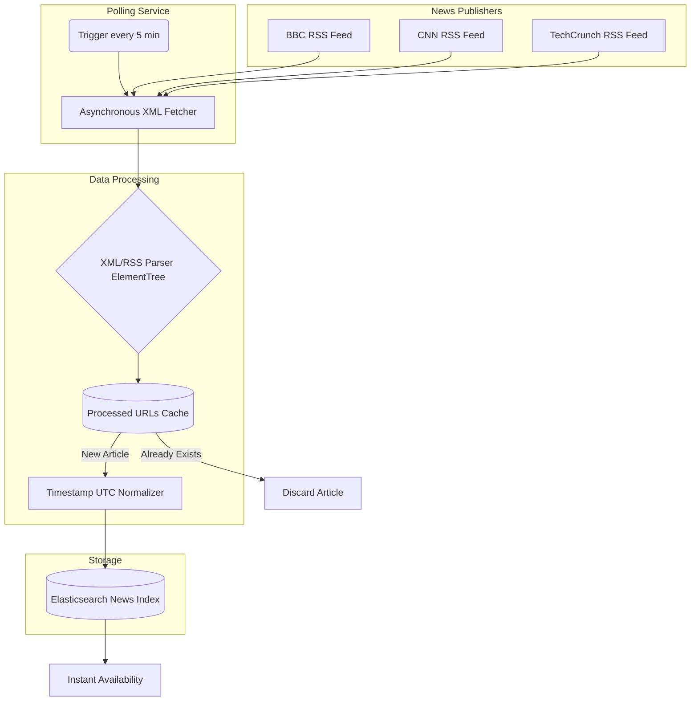
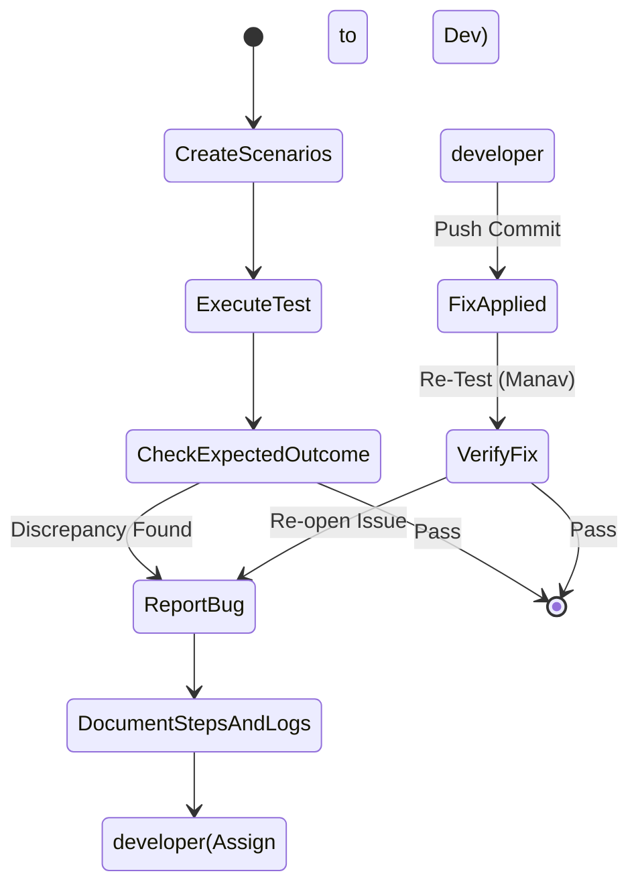

# Seekora Project - Role Definition & Implementation Details
**Team Member:** Manav
**Roles:** News Pipeline Engineer & Manual Testing Engineer

---

## 1. Introduction and Objectives
A modern search engine is fundamentally built upon trust, data ingestion velocity, and real-time awareness. As the News Pipeline Engineer, my primary mission was ensuring Seekora could serve breaking events just minutes after they were published globally, bypassing the slower general web crawler. This required specialized, real-time data ingestion models relying heavily on RSS structure rather than blind HTML scraping. Furthermore, as the Lead Manual Testing Engineer, I assumed the user's persona across the full platform lifecycle to identify bugs, edge cases, and UI friction that unit tests alone miss.

This document serves as a comprehensive viva guide, detailing the "What", "How", "Why", and "Where" of my contributions, including architectural diagrams, theoretical background, and logical pseudocode.

---

## 2. Role 1: News Pipeline Engineer

### 2.1 What Did I Do?
- Architected a specialized data ingestion pipeline distinct from the main web crawler that connects to various RSS Feeds (CNN, BBC, Reuters, TechCrunch).
- Developed a high-frequency polling service to gather articles instantly.
- Handled advanced timestamp normalization to handle time zones (UTC normalization) which determines the "Freshness" ranking metric.
- Extracted canonical titles, author metadata, and primary article summaries while filtering out ads and navigational elements.

### 2.2 Why Did I Do It This Way?
- **RSS Streams vs. Web Crawling:** A traditional crawler might visit "nytimes.com" once an hour. If an event happens, Seekora wouldn't know for an hour. RSS (Really Simple Syndication) is an XML feed structured explicitly for real-time publishing. Hooking into RSS provides instant push-updates without parsing HTML body layouts.
- **Dedicated News Index:** News queries ("Superbowl score") are handled differently from classic queries ("How to build a car"). News relies heavily on temporal relevance. I isolated news data into a specific Elasticsearch Index optimized for sorting by `published_date` rather than just keyword density.
- **Timestamp Standardization:** Time formats vary between publishers (`2024-03-01T12:00:00Z` vs `Fri, 01 Mar 2024 12:00:00 GMT+2`). They had to be converted to a uniform UNIX Epoch format (UTC) for accurate sorting logic.

### 2.3 Where Was This Done?
- `crawler/news_spider.py`: The specialized spider logic for parsing XML/RSS feeds asynchronously.
- `core/news_indexer.py`: The timestamp normalization and Elasticsearch ingestion logic.

### 2.4 How Was It Built? (Architecture & Flow)
The news integration works on a scheduled task (Cron/Celery) running every 5-15 minutes rather than an unbounded URL frontier queue.
1. The service holds a list of verified News Provider RSS URLs.
2. It fetches the XML file asynchronously.
3. It parses the feed items, checking redis to ensure the item hasn't already been processed.
4. It extracts structured fields `<title>`, `<description>`, `<pubDate>`, and `<link>`.
5. It formats the document and injects it into the Elasticsearch `news` index.

#### 2.4.1 News Pipeline Architecture Diagram


#### 2.4.2 Pseudocode for News Ingestion
```python
# pseudo_news_pipeline.py

import feedparser # Popular library for RSS/Atom formatting
from datetime import datetime
import pytz

class RealtimeNewsService:
    def __init__(self):
        self.sources = [
            'http://feeds.bbci.co.uk/news/rss.xml',
            'http://rss.cnn.com/rss/edition.rss'
        ]
        self.redis = RedisClient()
        self.es = ElasticsearchClient()
        
    async def run_polling(self):
        """Executed repeatedly by a scheduling mechanism (Cron)."""
        tasks = [self.parse_feed(url) for url in self.sources]
        await asyncio.gather(*tasks)

    async def parse_feed(self, rss_url):
        # 1. Fetch
        xml_feed = feedparser.parse(rss_url)
        
        for entry in xml_feed.entries:
            article_url = entry.link
            
            # 2. Check Cache
            if self.redis.exists(article_url):
                continue
                
            # 3. Clean Content
            title = strip_html(entry.title)
            snippet = strip_html(entry.get('summary', ''))
            
            # 4. Normalize Timestamp to UTC
            raw_date = entry.get('published_parsed', None)
            if not raw_date:
                utc_timestamp = current_time()
            else:
                raw_datetime = datetime.fromtimestamp(time.mktime(raw_date))
                utc_timestamp = raw_datetime.astimezone(pytz.utc).isoformat()
                
            # 5. Build Document
            news_document = {
                "source": getattr(xml_feed.feed, 'title', rss_url),
                "url": article_url,
                "title": title,
                "snippet": snippet,
                "published_at": utc_timestamp,
                "author": entry.get('author', 'Unknown')
            }
            
            # 6. Index & Cache
            try:
                self.es.index("news_articles", body=news_document)
                self.redis.set(article_url, "processed", expiry=86400 * 7) # Cache for 7 days
            except IndexingError as e:
                log_error("Failed to index news item:", e)

```

---

## 3. Role 2: Manual Testing Engineer

### 3.1 What Did I Do?
- Executed end-to-end regression testing across the entire platform UI/UX stack.
- Assured cross-browser compatibility (Chrome, Firefox, Safari) and mobile responsiveness.
- Tested edge cases in real-world environments (e.g., poor network conditions, broken server endpoints, malformed queries).
- Simulated stress test loads manually, tracking backend latency metrics.
- Ensured Dark Mode and Light Mode states toggled without layout shifts.

### 3.2 Why Did I Do It This Way?
- **User Empathy:** Automated tests (Jest/PyTest) verify that `1 + 1 = 2`. They do not confirm if the "Submit" button feels sluggish, or if a long article title breaks the CSS flexbox container by overlapping the thumbnail.
- **Defect Discovery:** I discovered critical UX flow interrupts (e.g., pagination not resetting when typing a new query), translating these findings into reproducible Jira tickets for the Frontend team.

### 3.3 Where Was This Done?
- `localhost:8000` & Staging Environments: The testing surface.
- Issue Tracker: Documenting the steps-to-reproduce for each defect.

### 3.4 How Was It Built? (Methodology)
Testing was structured through **Test Case Scenarios**:
1. **The Navigation Path:** User searches an empty string. The UI must validate cleanly prohibiting the search, rather than querying the backend and causing a 500 error.
2. **The "Broken State" Path:** Simulated backend failure (stopped Elasticsearch). Verified the React UI displayed a helpful fallback component rather than an obscure `TypeError: map is not a function`.
3. **The Data Density Path:** Injected a simulated search result with a 1,000-character description to verify CSS `.truncate` or `line-clamp` boundaries functioned correctly, preventing the UI from bleeding.

#### 3.4.1 Manual Defect Lifecycle Diagram


## 4. Challenges & Solutions
1.  **Duplicate News Stories in Feeds:** CNN would publish an article, update the headline ten minutes later, and the RSS feed would treat it as a new `<item>`, creating duplicate entries in Elasticsearch.
    *   *Solution:* Instead of hashing the entire content (which changed), I created a secondary Unique Constraint check on the core `canonical_url` structure. If the URL matched an existing document exactly, I explicitly issued an Elasticsearch `Update` operation rather than an `Insert`.
2.  **Cross-Platform UI Inconsistencies:** Safari mobile rendered scrollbars differently than Chrome Desktop, disrupting the "Infinite Scroll" visual layout.
    *   *Solution:* Through manual discovery, I alerted the UI engineer. We standardized scroll tracking to use `window.scrollY` combined with the DOM height rather than an absolute container `overflow` trick that varied by rendering engine.

## 5. Summary
By owning the News ingestion pipeline, I accelerated the search engine's heartbeat, transforming Seekora from a static archive into a real-time discovery platform by writing robust RSS polling mechanisms and strict UTC Normalization. My parallel execution manual testing guaranteed that alongside powerful engineering logic, the ultimate end-user experience remained polished, defensively avoiding silent failures and UI layout breakage during stress loads.
