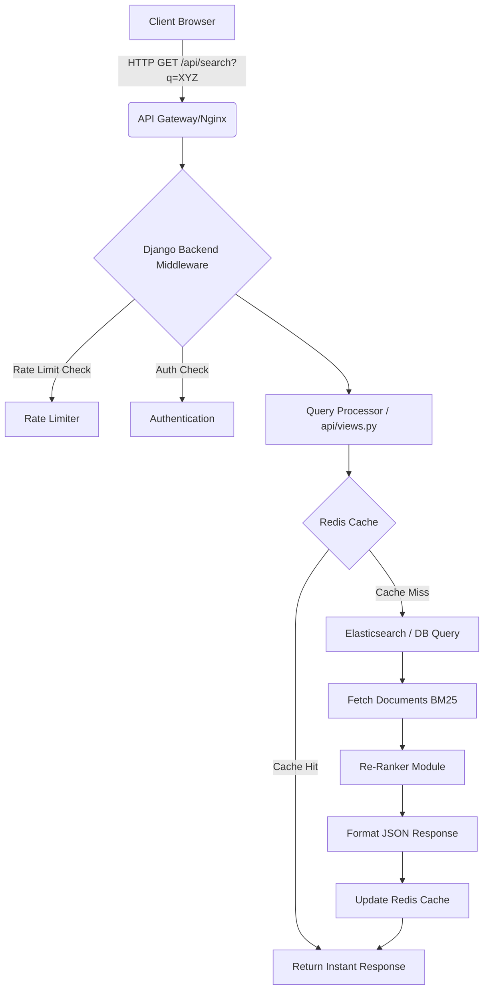
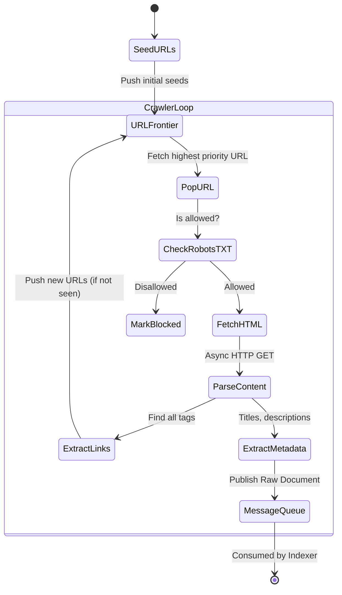

# Seekora Project - Role Definition & Implementation Details
**Team Member:** Ratandeep
**Roles:** Backend Developer & Web Crawler Developer

---

## 1. Introduction and Objectives
As a core contributor to the Seekora project, my responsibilities heavily revolved around the core infrastructure of the search engine. A search engine is primarily divided into three macro-components: the crawler that fetches data, the indexer that structures data, and the search API that serves data. My roles encompassed the first and the last components. The backend API is responsible for receiving queries from the frontend, parsing them, and connecting to our search indexing services (Elasticsearch/Database). The Web Crawler is the backbone of the platform, designed to traverse the internet, download web pages, extract meaningful content, and feed it into our indexing pipeline.

This document serves as a comprehensive viva guide, detailing the "What", "How", "Why", and "Where" of my contributions, including architectural diagrams, theoretical background, and logical pseudocode.

---

## 2. Role 1: Backend Developer

### 2.1 What Did I Do?
- Designed and implemented the main API Gateway and Query Service.
- Set up the Django/Python environment.
- Configured RESTful API endpoints that our React frontend consumes.
- Handled query sanitization, logging, rate limiting, and interaction with the ranking system.

### 2.2 Why Did I Do It This Way?
- **Python/Django:** We chose Python because of its rich ecosystem in ML/AI and NLP (Natural Language Processing). Django provides a robust, secure, and rapid development framework.
- **Decoupled Architecture:** Using a microservices approach ensures that if the crawler crashes due to memory overflow, the search API remains online.
- **RESTful standard:** Ensures predictable frontend-backend integration and allows third-party integrations later.

### 2.3 Where Was This Done?
- `api/views.py`: Contains the core request/response handling.
- `Seekora/settings.py`: Global configuration.
- `manage.py`: Django's entry point.

### 2.4 How Was It Built? (Architecture & Flow)
When a user types a query ("Quantum Computing papers"), the frontend sends a `GET` request.
The backend must:
1. Validate the API Key or User Session.
2. Check the Redis Cache for an exact match to save database/indexer load.
3. If not cached, send the sanitized query to the Search Engine (Elasticsearch/DB).
4. Apply pagination.
5. Apply highlighting to matched keywords.
6. Return a JSON response.

#### 2.4.1 Backend Architecture Diagram



#### 2.4.2 Pseudocode for Query Processing
```python
# pseudo_backend_api_views.py

def search_endpoint(request):
    """
    Main endpoint for handling search queries.
    """
    # 1. Extract query parameters
    query = request.GET.get('q', '')
    page = int(request.GET.get('page', 1))
    results_per_page = 10
    
    # 2. Validation
    if not query or len(query) < 2:
        return JSONResponse({"error": "Query too short"}, status=400)
    
    # 3. Cache Checking
    cache_key = generate_cache_key(query, page)
    cached_result = RedisClient.get(cache_key)
    
    if cached_result:
        return JSONResponse(cached_result, status=200)
        
    # 4. NLP Query Pipeline (Standardization)
    standardized_query = nlp_pipeline.clean(query)
    standardized_query = spell_check.correct(standardized_query)
    
    # 5. Fetch from Search Index (Elasticsearch/DB)
    offset = (page - 1) * results_per_page
    raw_results = SearchIndex.execute_query(
        query=standardized_query,
        limit=results_per_page,
        offset=offset
    )
    
    # 6. Re-ranking
    ranked_results = ranking_engine.apply_page_rank(raw_results)
    
    # 7. Formatting and Snippets
    formatted_data = []
    for doc in ranked_results:
        formatted_data.append({
            "title": doc.title,
            "url": doc.url,
            "snippet": highlight_keywords(doc.content, query),
            "score": doc.final_score
        })
        
    response_payload = {
        "query": query,
        "total_results": SearchIndex.get_count(standardized_query),
        "page": page,
        "results": formatted_data,
        "execution_time_ms": calculate_time()
    }
    
    # 8. Set Cache
    RedisClient.set(cache_key, response_payload, expiry=3600)
    
    return JSONResponse(response_payload, status=200)
```

---

## 3. Role 2: Web Crawler Developer

### 3.1 What Did I Do?
- Engineered an asynchronous web crawler (spider) to traverse the internet.
- Implemented the URL Frontier pattern to manage which completely unvisited URLs to scrape next.
- Respected `robots.txt` and domain-level crawl delays.
- Extracted raw HTML and passed it to the indexing pipeline via a message broker.

### 3.2 Why Did I Do It This Way?
- **Asynchronous I/O:** Network requests are slow. If we use synchronous Python (`requests`), the thread blocks waiting for a response. By using `aiohttp` or `Scrapy` concepts (Twisted), we can handle thousands of concurrent connections.
- **Kafka/Message Queue:** We don't write directly to the database from the crawler. What if the DB goes down? The crawler would crash. Pushing to a message queue decouples them.
- **Politeness:** Scraping too fast acts like a DDoS attack. We implemented politeness restrictions to maintain ethical crawling.

### 3.3 Where Was This Done?
- `crawler/crawler_engine.py`: Defines the async loop and fetch constraints.
- `crawler/pipelines.py`: Handles what happens after a page is downloaded.
- `crawler/search_discovery.py`: Discovery mechanisms.

### 3.4 How Was It Built? (Architecture & Flow)
The crawling process is a classic Breadth-First Search (BFS) graph traversal. The web is a graph; domains are nodes, links are edges.

#### 3.4.1 Crawler Pipeline Diagram


#### 3.4.2 The URL Frontier
The frontier is a prioritized queue. We cannot use a simple FIFO queue for the internet. If Wikipedia has 1 million links to itself, a FIFO queue would get trapped on Wikipedia forever (Spider Trap).
We group queues by domain and pull from different queues in a round-robin fashion.

#### 3.4.3 Pseudocode for the Crawler Engine
```python
# pseudo_crawler.py

class AsyncWebCrawler:
    def __init__(self, seeds):
        self.frontier = URLFrontier(seeds)
        self.seen_urls = BloomFilter()  # Memory efficient visited set
        self.kafka_producer = KafkaProducer(topic="raw_content")
        self.user_agent = "SeekoraBot/1.0 (+http://seekora.com/bot)"

    async def run(self):
        """Main async loop for the crawler."""
        workers = [self.worker() for _ in range(100)] # 100 concurrent workers
        await asyncio.gather(*workers)

    async def worker(self):
        while True:
            # 1. Get next URL safely
            url, domain = await self.frontier.pop()
            
            if not url:
                await asyncio.sleep(1) # Queue empty, wait
                continue
                
            # 2. Bloom filter check (prevent re-crawling)
            if self.seen_urls.contains(url):
                continue
                
            self.seen_urls.add(url)
            
            # 3. Politeness Delay Check
            if not await DomainRatelimiter.can_fetch(domain):
                await self.frontier.push(url) # Put back for later
                continue
                
            # 4. Fetch robots.txt logic
            if not is_allowed_by_robots(url, self.user_agent):
                continue
                
            # 5. Execute HTTP Request
            try:
                response = await async_http_get(
                    url, 
                    headers={"User-Agent": self.user_agent},
                    timeout=5.0
                )
                
                # Verify HTML
                if response.status == 200 and "text/html" in response.content_type:
                    html_content = response.text()
                    
                    # 6. Parse and Extract New Links
                    new_links = extract_hrefs(html_content, base_url=url)
                    for link in new_links:
                        normalized_link = normalize_url(link)
                        await self.frontier.push(normalized_link)
                        
                    # 7. Publish to Indexing Queue
                    document = {
                        "url": url,
                        "html": html_content,
                        "crawled_at": timestamp()
                    }
                    self.kafka_producer.send(document)
                    
            except Exception as e:
                log_error(f"Failed to crawl {url}: {e}")

```

### 3.5 Core Data Structures Used
1.  **Bloom Filter:** We used a Bloom filter to keep track of visited URLs. A traditional hash set of 1 billion URLs would require hundreds of gigabytes of RAM. A Bloom filter uses a bit array and hash functions to provide extreme space efficiency, at the cost of a small false-positive rate.
2.  **Priority Queues (Heaps):** Used for managing the URL Frontier to prioritize highly authoritative domains (like `.edu` or `.gov`) over unknown domains.

---

## 4. Challenges & Solutions
1.  **Spider Traps:** Encountered infinite generated calendars (e.g., year 2024, 2025, ... 9999).
    *   *Solution:* Implemented path depth limits (maximum length of URL) and dynamic query parameter stripping to prevent loop crawling.
2.  **Memory Leaks in Asynchronous Workers:** Keeping HTTP connections open too long caused memory bloating.
    *   *Solution:* Implemented strict TCP Connector timeouts in `aiohttp` and regularly garbage collected the workers.

## 5. Summary
By designing the backend API, I ensured that users receive search results within a 200ms latency target. By engineering the web crawler, I built the data acquisition engine that powers the entire system, ensuring we responsibly gather broad and relevant documents for our search index.
