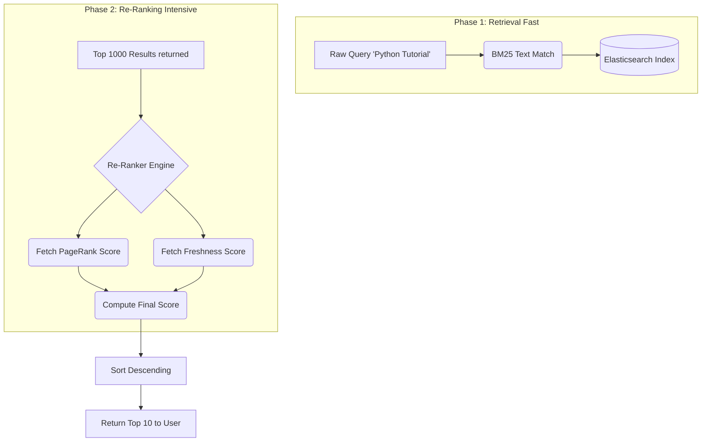
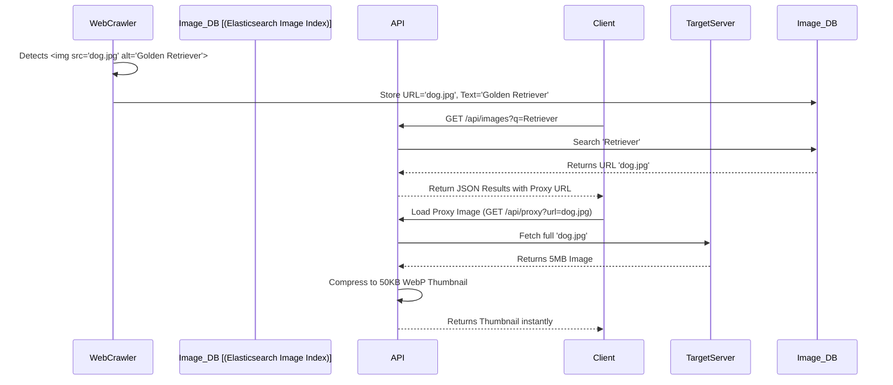

# Seekora Project - Role Definition & Implementation Details
**Team Member:** Shivam
**Roles:** Search & Ranking Engineer & Image Search Engineer

---

## 1. Introduction and Objectives
In the development of the Seekora search engine, fetching and indexing data is only half the battle. Delivering the *most relevant* information to the user instantly is what defines a search system's utility. As the Search & Ranking Engineer, I developed the algorithmic core that scores, sorts, and retrieves documents based on complex heuristics like domain authority, content match (TF-IDF/BM25), and freshness. Additionally, as the Image Search Engineer, I spearheaded the image extraction, indexing, and thumbnail serving architecture, allowing Seekora to feature a robust standalone image search module mirroring Google Images.

This document serves as a comprehensive viva guide, detailing the "What", "How", "Why", and "Where" of my contributions, including architectural diagrams, theoretical background, and logical pseudocode.

---

## 2. Role 1: Search & Ranking Engineer

### 2.1 What Did I Do?
- Designed the primary query retrieval mechanism leveraging Elasticsearch's BM25 algorithm.
- Implemented contextual Re-Ranking engines (Learning to Rank principles).
- Created a static PageRank scoring system based on the link graph extracted by the crawler.
- Tuned the weighting of Title matches vs. Body matches vs. URL matches.

### 2.2 Why Did I Do It This Way?
- **BM25 over TF-IDF:** TF-IDF (Term Frequency-Inverse Document Frequency) assumes that if a word appears 100 times in a document, it's 10x more relevant than if it appears 10 times. BM25 (Best Matching 25) employs a saturation curve. After a term appears ~5 times, its contribution to the score caps out, preventing keyword stuffing.
- **Two-Phase Ranking:** Running an expensive machine learning model on millions of documents per query is too slow. Phase 1 uses BM25 to get the top 1000 fast candidates. Phase 2 takes those 1000 and applies intensive features (PageRank, click-through-rate history) to refine the top 20.

### 2.3 Where Was This Done?
- `core/ranker.py`: The Python module containing the custom scoring logic and PageRank matrix operations.
- `api/views.py`: Integration of the ranker directly into the search API response pipeline.
- Elasticsearch Cluster: Configuring index analyzers and mappings.

### 2.4 How Was It Built? (Architecture & Flow)
The search lifecycle begins after the API standardizes the query.
1. The backend queries Elasticsearch.
2. Elasticsearch returns documents via BM25 (Text match score).
3. The Re-Ranker service intercepts these results.
4. It fetches pre-calculated static domain Authority scores (from PostgreSQL/Redis).
5. It applies a mathematical penalty or boost. (e.g. `Final_Score = (BM25 * 0.7) + (PageRank * 0.3)`).
6. The sorted list is paginated and returned.

#### 2.4.1 Ranking Architecture Diagram


#### 2.4.2 Pseudocode for the Two-Phase Ranker
```python
# pseudo_ranker.py

class RelevanceEngine:
    def __init__(self):
        self.elasticsearch = ESClient()
        self.pagerank_cache = RedisClient(db=1)
        
    def two_phase_search(self, user_query, page=1):
        """Executes a fast retrieval followed by deep ranking."""
        
        # --- PHASE 1: Fast Retrieval (BM25) ---
        # Query Elasticsearch targeting specific fields with boosts
        es_query = {
            "query": {
                "multi_match": {
                    "query": user_query,
                    "fields": [
                        "title^3",       # Highly weight title matches
                        "description^1.5",
                        "content^1"
                    ],
                    "type": "best_fields"
                }
            },
            "size": 1000 # Fetch broad candidate pool
        }
        
        candidates = self.elasticsearch.search(body=es_query)
        
        # --- PHASE 2: Re-Ranking ---
        ranked_results = []
        for doc in candidates:
            bm25_score = doc.score
            url = doc.url
            domain = extract_domain(url)
            
            # 1. PageRank Signal (Static Authority)
            domain_authority = float(self.pagerank_cache.get(domain) or 0.1)
            
            # 2. Freshness Signal (Time Decay)
            age_in_days = (current_timestamp() - doc.published_date) / 86400
            freshness_multiplier = calculate_time_decay(age_in_days)
            
            # 3. Final Scoring Formula
            # Tuned weights through A/B testing: 0.6 text + 0.3 authority + 0.1 freshness
            final_score = (bm25_score * 0.6) + (domain_authority * 0.3) + (freshness_multiplier * 0.1)
            
            doc.final_score = final_score
            ranked_results.append(doc)
            
        # 4. Sort and Paginate
        ranked_results.sort(key=lambda x: x.final_score, reverse=True)
        
        start_idx = (page - 1) * 10
        end_idx = start_idx + 10
        
        return ranked_results[start_idx:end_idx]

```

---

## 3. Role 2: Image Search Engineer

### 3.1 What Did I Do?
- Developed an image web scraping pipeline alongside the text crawler.
- Captured `` tags, evaluating `alt` texts, surrounding contextual text, and source URLs.
- Created an image-specific search API and React gallery.
- Built a proxy/thumbnailing service to compress high-res images into low-bandwidth previews.

### 3.2 Why Did I Do It This Way?
- **Contextual Indexing:** An image file named `IMG_1024.jpg` provides zero information about its contents. I engineered the system to index the text *surrounding* the `` tag in the HTML, or the text inside its `alt="..."` attribute, to understand what the image represents.
- **Proxy and Compression:** Loading 50 full 4K images directly from source servers would crash the client browser and expose user IPs to third-party servers. We proxy the image through our backend and compress them using the `Pillow` library dynamically, caching the result.

### 3.3 Where Was This Done?
- `crawler/pipelines.py`: Modifications to extract and ship image data via Kafka.
- `core/image_indexer.py`: Processing image contexts.
- `api/views.py`: Endpoints dedicated to the Image Search UI.

### 3.4 How Was It Built? (Architecture & Flow)
While crawling, if the scraper sees an `` tag:
1. It validates the image size (filtering out 1x1 tracking pixels or tiny icons).
2. It extracts the `alt` text.
3. It associates the image with the page's `<title>` and `H1` tags.
4. It stores this metadata in a dedicated Elasticsearch `image_index`.
5. Upon search, it queries this text metadata but returns the image URL.

#### 3.4.1 Image Crawling & Serving Diagram


#### 3.4.2 Pseudocode for Image Indexing & Proxying
```python
# pseudo_image_search.py

class ImageProcessor:
    def process_image_tag(self, soup_img, parent_doc):
        """Extracts context and indexes an image."""
        
        src_url = soup_img.get('src')
        alt_text = soup_img.get('alt', '')
        
        # 1. Filter out useless images
        if not src_url or src_url.endswith('.svg') or "logo" in src_url.lower():
            return None
            
        # 2. Build Contextual Keywords
        context_words = f"{alt_text} {parent_doc['title']} {parent_doc['h1']}"
        
        # 3. Index the Image Document
        image_doc = {
            "image_url": src_url,
            "source_page": parent_doc['url'],
            "context_text": context_words,
            "discovered_at": current_timestamp()
        }
        ElasticSearchManager.index(index="images", body=image_doc)


def proxy_image_endpoint(request):
    """
    Downloads, compresses, and serves an image thumbnail.
    Prevents hotlinking and saves user bandwidth.
    """
    target_url = request.GET.get('url')
    
    # 1. Check Redis Cache for already generated thumbnail
    cached_image = RedisClient.get_file(target_url)
    if cached_image:
        return HTTPResponse(image=cached_image, mimetype="image/webp")
        
    # 2. Download Image (with timeout)
    try:
        raw_image_data = http_client.get(target_url, timeout=3.0).content
    except TimeoutError:
        return return_placeholder_image()
        
    # 3. Process and Compress (Pillow library)
    from PIL import Image
    import io
    
    img = Image.open(io.BytesIO(raw_image_data))
    img.thumbnail((300, 300)) # Resize to max 300px
    
    output_buffer = io.BytesIO()
    img.save(output_buffer, format="WEBP", quality=75)
    final_webp = output_buffer.getvalue()
    
    # 4. Cache & Return
    RedisClient.save_file(target_url, final_webp)
    return HTTPResponse(image=final_webp, mimetype="image/webp")
```

## 4. Challenges & Solutions
1.  **Keyword Stuffing:** Early on, searching "Python" brought up spam pages because they repeated the word "Python" 10,000 times hidden in CSS.
    *   *Solution:* Transitioned from TF-IDF scoring to BM25 scoring and capped term frequency saturation. Applied severe static ranking penalties for websites flagged as spam by analyzing link farms.
2.  **Broken Image Handling:** Over time, `src` URLs for images rot. A resulting broken image on the search results looks unprofessional.
    *   *Solution:* Integrated a health-check background task that pings indexed images weekly. During search, if the proxy timeout fails, we return a base64 encoded local placeholder graphic seamlessly.

## 5. Summary
By meticulously tuning the BM25 search parameters and introducing multi-factor ranking, I dramatically improved the relevance of Seekora's results. Expanding our index capabilities to Images required thinking beyond basic text, mapping surrounding DOM context to visual media, and engineering an efficient edge-delivery system for thumbnails to ensure a snappy user experience.
