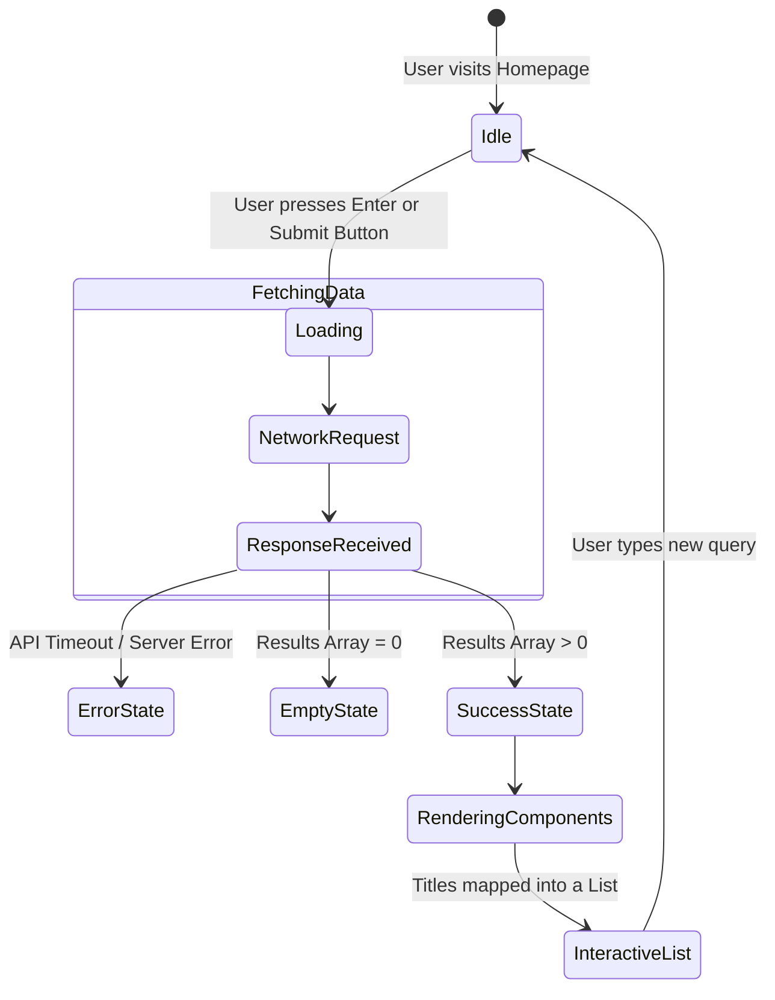
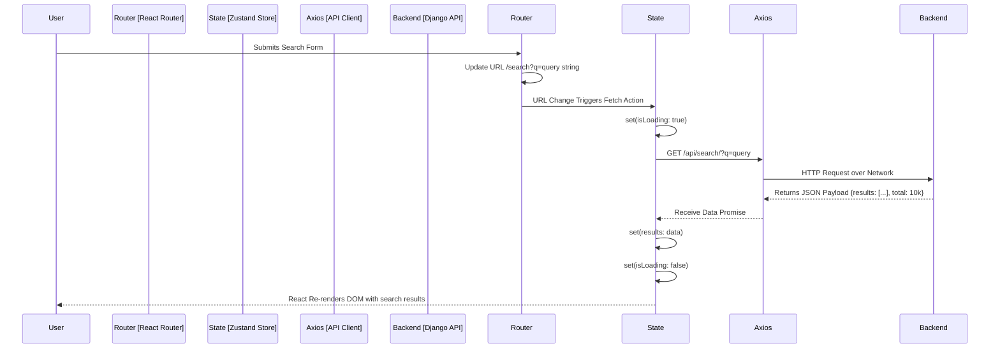

# Seekora Project - Role Definition & Implementation Details
**Team Member:** Vanshika
**Roles:** Frontend Developer (UI/UX) & Frontend Integration Engineer

---

## 1. Introduction and Objectives
The front lines of any search engine dictate the user's perception of its speed, reliability, and precision. A backend can search a billion documents in 10ms, but if the frontend is clunky or poorly designed, the user assumes the entire system is broken. As the Frontend Developer and Integration Engineer, I designed the face of Seekora (UI/UX) and engineered the underlying React architecture to stitch the frontend seamlessly to the Django API backend.

This document serves as a comprehensive viva guide, detailing the "What", "How", "Why", and "Where" of my contributions, including architectural diagrams, theoretical background, and logical pseudocode.

---

## 2. Role 1: Frontend Developer (UI/UX)

### 2.1 What Did I Do?
- Architected the visual language and Search Engine Results Page (SERP) layout.
- Developed reusable, accessible UI components (Search Bar, Result Snippets, Pagination controls).
- Styled the application using modern CSS principles prioritizing minimal bloat and responsive design.
- Implemented micro-interactions: input focus states, loading skeletons, and hover animations.
- Handled Dark Mode and Light Mode state implementations via CSS variables.

### 2.2 Why Did I Do It This Way?
- **Minimalist Design Language:** Search engines are utility tools. Large flashy graphics distract from the core goal: finding an answer. I drew inspiration from Google and DuckDuckGo, maintaining vast whitespace, legible typography (System UI fonts), and clear visual hierarchy.
- **CSS Variables over Frameworks:** While Tailwind or Bootstrap are popular, I chose raw CSS with custom properties (`var(--primary-color)`) for the core styling. This guaranteed zero unused CSS shipped to the client, maximizing load speeds, which is paramount for search engines.
- **Accessibility (A11y):** Adding `aria-labels`, respecting keyboard navigation (Tab-indexing), and maintaining high contrast ratios ensures Seekora is usable by everyone, including screen readers.

### 2.3 Where Was This Done?
- `client/src/index.css`: The master stylesheet and color tokens.
- `client/src/features/search/pages/HomePage.tsx`: The minimalist landing interface.
- `client/src/features/search/pages/ResultsPage.tsx`: The complex SERP rendering.

### 2.4 How Was It Built? (Design Architecture)
The user journey is heavily state-dependent:
1. `Initial State`: The centered logo and search input (hero layout).
2. `Loading State`: Skeleton placeholders render while the API responds to prevent layout shift.
3. `Success State`: Render mapped lists of components with Title, URL, and Snippet elements.
4. `Empty State`: A helpful message if zero results match the query.

#### 2.4.1 UI State Machine Diagram


#### 2.4.2 Structure of a Search Result UI component
```tsx
// pseudocode_ResultItem.tsx

interface SearchResultProps {
  title: string;
  url: string;
  snippet: string;   // Contains HTML <em> tags for highlighting
  favicon_url: string;
}

const ResultItem: React.FC<SearchResultProps> = ({ title, url, snippet, favicon_url }) => {
  // 1. Accessibility Checks and Formatting
  const safe_snippet = DOMPurify.sanitize(snippet);
  
  // 2. Component Rendering
  return (
    <article className="search-result-card" role="article" aria-labelledby="result-title">
        
      {/* Container for URL and Favicon branding */}
      <div className="site-branding">
          
          <cite className="url-breadcrumb">{formatUrlBreakdown(url)}</cite>
      </div>
      
      {/* Primary Clickable Title */}
      <h3 id="result-title" className="title-heading">
          <a href={url} target="_self" rel="noopener noreferrer">
             {title}
          </a>
      </h3>
      
      {/* Highlighted Snippet via dangerouslySetInnerHTML given backend sanitization */}
      <p 
        className="snippet-description" 
        dangerouslySetInnerHTML={{ __html: safe_snippet }} 
      />
      
    </article>
  );
};
```

---

## 3. Role 2: Frontend Integration Engineer

### 3.1 What Did I Do?
- Wrote the data-fetching architecture using React Hooks or Zustand/Redux for centralized state management.
- Connected the frontend `Search Bar` input directly to the Django REST Framework backend.
- Managed API side-effects (canceling pending requests if a new one is typed quickly).
- Implemented client-side routing (`react-router-dom`) linking `/search?q=query` to the URL bar for shareability.

### 3.2 Why Did I Do It This Way?
- **Global State Store (Zustand):** Instead of passing Props down an endless tree of components ("prop drilling"), a global store holds `query`, `results`, `isLoading`, and `error`. Any component can access the search state instantly.
- **URL-Driven State:** If a user searches "Python" and copies the URL `seekora.com/search?q=Python`, it must load that exact search when shared. Therefore, the React App's state is heavily synced to the query parameters in the address bar, rather than just local React state.
- **Debouncing:** When building predictive text or fast searching, we wait 300ms after the user stops typing before hitting the API. This prevents flooding the backend with 15 requests for a 15-letter word.

### 3.3 Where Was This Done?
- `client/src/features/search/stores/searchStore.ts`: Global state logic.
- `client/src/api/apiClient.ts`: Axios configuration for backend communication.

### 3.4 How Was It Built? (Data Integration)
The React frontend and Django backend communicate strictly via JSON over HTTP.
1. The user presses Enter.
2. React updates the browser URL (e.g., `?q=hello&page=2`).
3. `useEffect` detects the URL change and triggers the store fetch action.
4. Axios makes the GET request.
5. The result populates the global store.
6. React automatically re-renders the UI based on the new store contents.

#### 3.4.1 Frontend Data Flow Integration Diagram


#### 3.4.2 Pseudocode for State Management and Network Calls
```typescript
// pseudo_searchStore.ts

import { create } from 'zustand';
import axios from 'axios';

interface SystemState {
    query: string;
    results: any[];
    search_time: number;
    isLoading: boolean;
    error: string | null;
    
    executeSearch: (q: string, page: number) => Promise<void>;
}

export const useSearchStore = create<SystemState>((set) => ({
    query: '',
    results: [],
    search_time: 0,
    isLoading: false,
    error: null,
    
    executeSearch: async (q, page) => {
        // 1. Enter Loading State immediately
        set({ isLoading: true, error: null, query: q });
        
        try {
            // 2. Execute Network Request
            const response = await axios.get(`http://api.seekora.local/search`, {
                params: {
                    query: q,
                    p: page
                },
                timeout: 5000 // Ensure UI doesn't hang forever
            });
            
            // 3. Update Global Store with Success
            if (response.data) {
                set({
                    results: response.data.results,
                    search_time: response.data.execution_time_ms,
                    isLoading: false
                });
            }
            
        } catch (err: any) {
            // 4. Handle Network or Parsing Errors Gracefully
            let msg = "A network error occurred connecting to Seekora Servers.";
            if (err.response && err.response.status === 429) {
                msg = "Rate limit exceeded. Please try again in a minute.";
            }
            set({ error: msg, isLoading: false, results: [] });
        }
    }
}));
```

## 4. Challenges & Solutions
1.  **Layout Shifts During Loading:** Initially, the search results page would jump aggressively while images (favicons or thumbnails) loaded, ruining the user experience.
    *   *Solution:* Implemented strict width/height boundaries via CSS on dynamic media. Added Skeleton Loading `.shimmer` interfaces that matched the approximate height of text blocks while the API was waiting to respond.
2.  **API Race Conditions:** If a user mashed the "Page 2" then "Page 3" buttons rapidly, the async responses might return out of order. Page 2 data might arrive *after* Page 3, showing the user the wrong data.
    *   *Solution:* Engineered an `AbortController` mechanism. If a new API call is initiated before the older one finishes, the browser actively kills the older network request so state cannot be corrupted by stale returning data.

## 5. Summary
Building Seekora's client necessitated balancing raw performance with clear, intuitive aesthetics. As the UI/UX Developer, I crafted a distraction-free layout to present highly technical data simply. Concurrently, as the Integration Engineer, I built a rigid state-management system ensuring smooth URL navigation and robust error handling when interfacing with the backend Django cluster, keeping Seekora responsive under heavy networking conditions.
